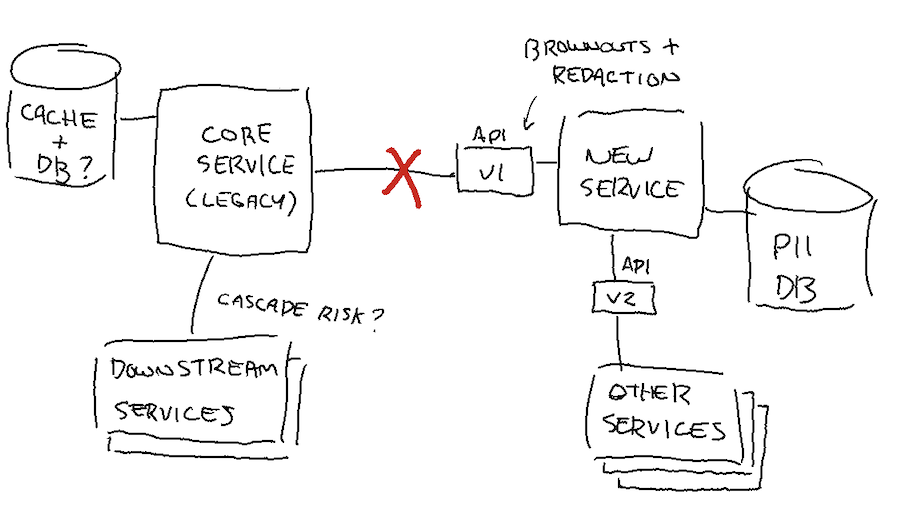
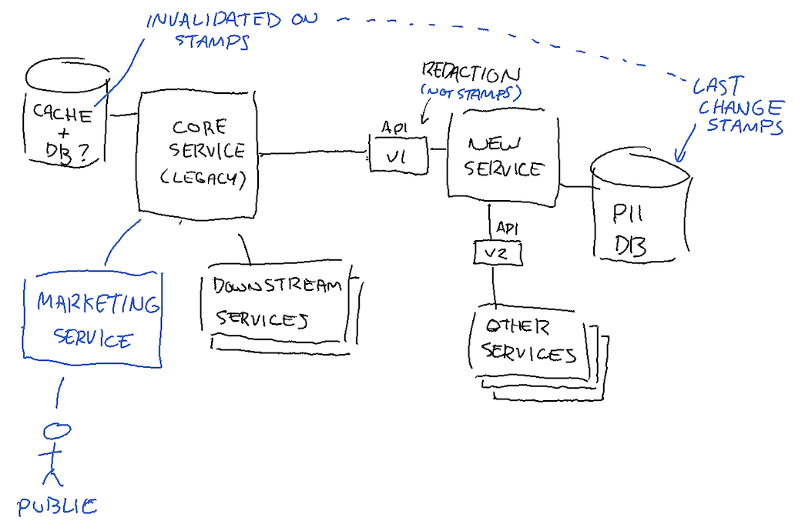
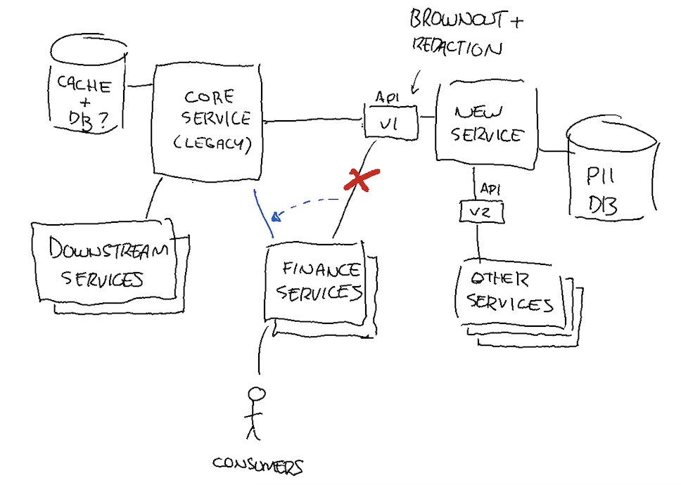

# The Vignette

## Setup

You are at an organization that runs a system with multiple services that communicate with each other over the network. They have separate storage layers and dedicated databases, although some data is necessarily redundant across the boundaries, as frequent workarounds for performance have demanded over the years.

As is common in many companies that have grown quickly, there’s a mixture of older services that contain a lot of business-critical data and the code to handle it, and newer services that maintainers believe are cleaner and represent a model for going forward, particularly since recently delivered features exceeded expectations.At this point in time, the organization is now large enough to support multiple on-call rotations, and while some people have knowledge spanning across many of them, most employees do not and are content trying to manage everything in their existing rotation.

A point of contention has arisen in the last few months. That is the speed at which some services can be updated by solo teams when others that depend on them do not have the priorities and roadmap to follow along with the updates in lockstep. As such, changes in format or structure of the information returned by the APIs are required to be compatible both with older and newer users.

One of the countries your company operates in has recently changed regulations and mandated some data must be off- limits in marketing and advertising initiatives. However, this data is necessary for financial reporting and it still needs to be kept around and made available to some consumers.

The service handling its storage is one of the new ones, and it made a new API version available without these fields depending on who the caller is and whether they are impacted by that law. To avoid messing with the older core services during the migration period, the older API version still returns the data until the new law becomes active, but an extra optional field was added to the serialization format marking it as sensitive and deprecated.

Two weeks before the law became active at its planned date, engineers of that service ran a code change on the old API so that the sensitive fields would be zeroed out (with the flags still marking them as off-limits) to make sure the data couldn’t be used anymore. They started injecting increasing failure rates on the calls that weren’t allowed to use that data to force anyone still using it to notice any problems, giving them time to address it. A few teams called and got an explanation, rushed to adjust, and moved on. Some teams just stopped calling the endpoint on their own. The calls left coming through had no clear identification as to the source and were denied the information.

## Phase 1

On the day the law became active, the old API endpoint got flat out deprecated and stopped responding in order to be fully compliant with the new regulation.

Within the hour, alerts started blaring and an outage of moderate severity got declared. One of the old core services still relied on the old API and had simply retried its way through the brownouts to keep its cache of the data fresh, which was no longer possible. The failures on that service caused delays on its processing pipeline and its error rate was gradually climbing more and more.

The incident response team identified the issue as the fields covered by the old API being cached into the old service and gradually timing out while being unable to refresh them. As long as the rows were cached in their local database, they could serve traffic, but any one that got ejected would rely on the API giving a response to refresh the record and succeed. The more time passed, the higher the error rates.

Other services in the organization relying on the core service were starting to feel the error rates and cascade in turn.

## Phase 2

Your team has chosen to bring back the old API endpoint with redacted data, and then invalidate the cache in the core service and force it to refresh it with redacted data from the old API endpoint. The system has been stabilized.

As part of your approach to handling this incident you brought in, amongst others, the security department for compliance and the legal department for liability to assess the plan. They both say that the old system should really prioritize moving off the API, but since the fields were redacted you should be okay.

However, later that day someone detected marketing material going out publicly that still used the original information. After some investigation, it was determined that a bug in how the cache was invalidated meant that if the records had not changed (as indicated by a timestamp), the old core service simply kept them as-is in their storage. Since the data redaction on the old API did not happen within storage, the timestamp for the last update never got changed and the data redaction never got propagated.

Downstream services therefore still had access to the information and were using it in breach of the law.

## Phase 3

You breathe a sigh of relief that the crisis has been averted and move to an incident review. But....

One week later, a critical service comes up with problems in another part of the organization. They have to send out important financial reports and they used the information from the old core services to populate them.
Because the core service aggregated and distributed data from many smaller services (including the new one that redacted data), its information was used as-is.

The act of flushing the cache and redacting data had “corrupted” the information they used, and they’re short on time to update the software there because the software has a third party integration and requires consultants to get involved.

What’s more, you find out that this is a broader pattern and other teams might be in the same situation.
It was even suggested that more services started depending on that core service during the brownouts because they kept the data available and they were reputed for their API stability (a benefit of being an old, slow-moving service).

